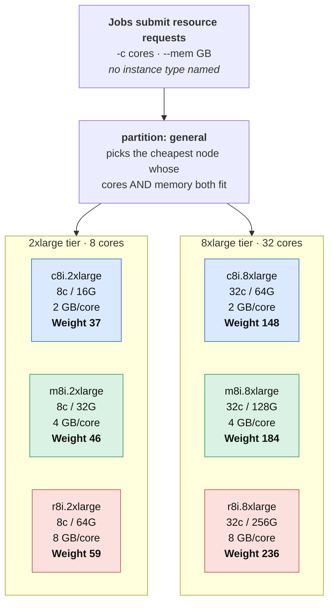
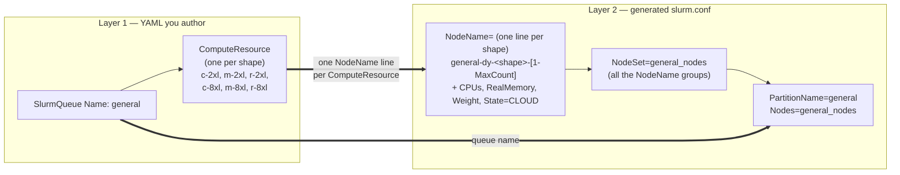
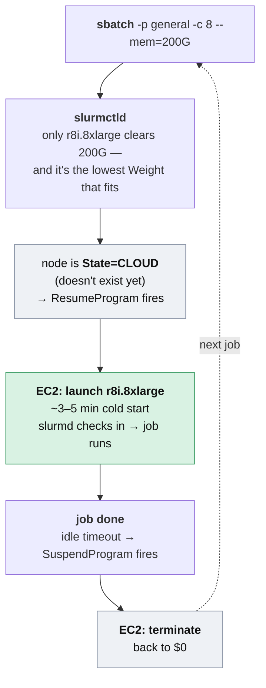

# One Partition, Many Machines: Right-Sizing Slurm Nodes on AWS

*How to back a single Slurm partition with a menu of instance types and sizes, and let
the scheduler pick the cheapest machine whose cores and memory actually fit each job.*

---

## The problem in one sentence

On a traditional HPC cluster, a partition is a fixed pile of identical hardware — the
same boxes, always powered on. So a job that needs 4 cores and a job that needs 400 GB
of RAM land on the same machine shape, and you buy that shape for the worst case. On the
cloud the nodes behind a partition don't exist until a job needs them, and *which*
machine materializes can differ from one job to the next. So the interesting question
becomes: **how do you describe a single partition that quietly puts a compute-bound job
on a cheap compute node and a memory-hungry job on a fat-memory node — without the user
choosing an instance type, and without paying for idle hardware?**

This post walks through how to do that with Slurm on AWS — and the `slurm.conf`
machinery that turns a job's `--cpus` / `--mem` request into the cheapest instance type
*and* size that fits. The worked example uses AWS ParallelCluster, but the same idea
carries to the managed AWS Parallel Computing Service and to bursting an on-prem cluster
into AWS — both covered near the end.



<p align="center"><em>Three families give three memory-to-core ratios — <b>c</b> (compute, 2 GB/core),
<b>m</b> (general, 4 GB/core), <b>r</b> (memory-optimized, 8 GB/core) — at two sizes each.
The request's <b>shape</b> (memory-to-core) picks the family; its <b>size</b> picks the tier;
<code>Weight ≈ price</code>, so the scheduler takes the cheapest fit. Nothing runs until a job
selects a shape — the whole catalog sits at <code>$0</code> when the queue is idle.</em></p>

A user never names an instance type; they state what the job needs, and Slurm lands it
on the cheapest node where both the cores and the memory fit. The rest of this post is
how those boxes, and that selection rule, come to exist.

> **A couple of terms, up front.** This post assumes you've used Slurm but not
> necessarily the AWS side:
> - **`Weight`** — a per-node Slurm setting. When several idle nodes can run a job,
>   Slurm chooses the one with the *lowest* `Weight`. Set `Weight` proportional to a
>   node's hourly price and "lowest weight" becomes "cheapest." This is the linchpin of
>   the whole scheme.
> - **Spot** — deeply discounted EC2 capacity (often ~70% off) that AWS can reclaim on
>   short notice. Ideal for work that can be requeued and rerun.
> - **`slurmctld` / `slurmd`** — the Slurm controller daemon (the scheduler's brain, on
>   the head node) and the per-node agent that launches and supervises jobs.

## Background: what a partition is

In Slurm, users submit jobs to a **partition** — a named set of nodes with some policy
attached: a wall-time limit, a priority, who's allowed to use it.

On bare metal, the nodes behind a partition are bought, racked, and never change.
`sinfo` shows you the same fixed boxes today that it showed last year, and every node in
the partition has the same core count and the same RAM. The partition *is* the hardware,
so a 4-core job and a 400-GB job share a shape sized for the larger of the two.

The cloud breaks that assumption in a useful way: the nodes don't exist until a job
needs them. They're **defined** in config, **materialized** on demand, and
**destroyed** when idle. That unlocks two things at once:

- **The nodes are ephemeral.** At rest, a partition is backed by *zero* running
  machines — just definitions. Instances appear when a job is queued and disappear when
  it finishes, so a heterogeneous menu costs nothing to *offer*.
- **The nodes are heterogeneous.** A single partition can list a whole menu of instance
  shapes and sizes, and the decision of which one to boot is deferred to the moment a
  job starts — driven by what that job asked for.

Put those together and a partition stops being "a pile of identical boxes" and becomes
"a catalog of shapes the scheduler chooses from per job." The `slurm.conf` machinery
below is what makes that real.

## The two layers

AWS ParallelCluster won't let you hand-write `PartitionName=... Nodes=...` lines into
`slurm.conf` directly — it *generates* them from a higher-level YAML description. So
"many instance shapes → one partition" is expressed across two layers.

### Layer 1 — the YAML you author

A **queue** contains one or more **compute resources**. Each compute resource is a node
group with one instance shape and its own scaling limits. To build the menu from the
opening diagram, you list six of them under a single queue:

```yaml
SlurmQueues:
  - Name: general                # ← becomes the Slurm partition
    ComputeResources:
      - Name: c-2xl              # compute-optimized, small
        Instances: [ { InstanceType: c8i.2xlarge } ]
        MinCount: 0
        MaxCount: 50
      - Name: m-2xl              # general-purpose, small
        Instances: [ { InstanceType: m8i.2xlarge } ]
        MinCount: 0
        MaxCount: 50
      - Name: r-2xl              # memory-optimized, small
        Instances: [ { InstanceType: r8i.2xlarge } ]
        MinCount: 0
        MaxCount: 50
      - Name: c-8xl              # compute-optimized, large
        Instances: [ { InstanceType: c8i.8xlarge } ]
        MinCount: 0
        MaxCount: 50
      # ...m-8xl, r-8xl the same way...
```

Each compute resource is one shape (family × size); together they're the catalog. The
`c`/`m`/`r` families give you three memory-to-core ratios (2, 4, 8 GB/core); the
`2xlarge`/`8xlarge` sizes give you two tiers. Six node groups, one partition.

### Layer 2 — the Slurm config ParallelCluster generates

At boot, ParallelCluster expands that YAML into a per-queue partition file under
`/opt/slurm/etc/pcluster/`. The result — the part that matters — looks like this:

```
NodeName=general-dy-c-2xl-[1-50]  CPUs=8  RealMemory=15564  State=CLOUD Feature=dynamic,c8i.2xlarge,c-2xl Weight=37
NodeName=general-dy-m-2xl-[1-50]  CPUs=8  RealMemory=31129  State=CLOUD Feature=dynamic,m8i.2xlarge,m-2xl Weight=46
NodeName=general-dy-r-2xl-[1-50]  CPUs=8  RealMemory=62259  State=CLOUD Feature=dynamic,r8i.2xlarge,r-2xl Weight=59
NodeName=general-dy-c-8xl-[1-50]  CPUs=32 RealMemory=62259  State=CLOUD Feature=dynamic,c8i.8xlarge,c-8xl Weight=148
NodeName=general-dy-m-8xl-[1-50]  CPUs=32 RealMemory=124518 State=CLOUD Feature=dynamic,m8i.8xlarge,m-8xl Weight=184
NodeName=general-dy-r-8xl-[1-50]  CPUs=32 RealMemory=249036 State=CLOUD Feature=dynamic,r8i.8xlarge,r-8xl Weight=236

NodeSet=general_nodes Nodes=general-dy-c-2xl-[1-50],general-dy-m-2xl-[1-50],general-dy-r-2xl-[1-50],general-dy-c-8xl-[1-50],general-dy-m-8xl-[1-50],general-dy-r-8xl-[1-50]
PartitionName=general Nodes=general_nodes MaxTime=INFINITE State=UP Default=YES
```

<p align="center"><em>This is real output from a live ParallelCluster 3.15.1 cluster (lightly reformatted).
The <code>RealMemory</code> values are ~95% of nominal — ParallelCluster reserves headroom, so a
16 GB node reports 15564.</em></p>

The mapping chain — what in the YAML becomes what in the generated config:



<p align="center"><em>Each compute resource becomes one <code>NodeName</code> group; all of them are
gathered into a <code>NodeSet</code>; a single <code>PartitionName</code> points at that set.</em></p>

It helps to separate the *Slurm keywords* (they mean something to the scheduler) from
the *strings ParallelCluster picked* (they could be anything). `NodeName=`, `CPUs=`,
`RealMemory=`, `State=`, `Feature=`, `Weight=`, `NodeSet=`, and `PartitionName=` are all
Slurm keywords. The node *names* (`general-dy-c-2xl-1`) and the `Feature=` *value*
(`c8i.2xlarge`) are arbitrary labels — ParallelCluster generated them, but Slurm
attaches no meaning to the text. Four keywords carry this design:

1. **`CPUs=` and `RealMemory=`** describe each shape to the scheduler. This is what lets
   Slurm reason about whether a job *fits* a node — the heart of the next section.

2. **`Weight=` encodes price.** Here each node's weight is roughly its hourly cost. When
   more than one idle node can run a job, Slurm picks the lowest weight — i.e. the
   cheapest node that fits. (Weights are illustrative; set them from real pricing — only
   the relative order matters.) You don't write this line by hand: set
   `DynamicNodePriority` on the compute resource in the YAML and ParallelCluster emits the
   `Weight`. (Tempting trap: you *cannot* set it with a second `NodeName=` line in the
   Slurm include file — Slurm reads that as a duplicate node and refuses to start.)

3. **`State=CLOUD` makes the nodes ephemeral** — a Slurm keyword. It tells the scheduler
   these nodes don't exist yet. When a job needs one, Slurm's power-save plugin calls a
   `ResumeProgram` (a script that launches the EC2 instance); when the node goes idle, a
   `SuspendProgram` terminates it. You pay only while a job runs. (The `-dy-` in the node
   name is *not* a keyword — just ParallelCluster's label for dynamic nodes, versus
   `-st-` for always-on static ones.)

4. **`[1-50]`** mirrors `MaxCount: 50` — the ceiling on how many nodes of *each* shape can
   exist at once (it's Slurm range notation; bump it and the same line scales). Because
   it's per-shape, six shapes at 50 means the partition can reach 300 nodes — capping the
   partition as a whole is a policy-overlay job, covered later.

## How the scheduler right-sizes each job

Here's the payoff. A user submits with resource requests — not an instance type:

```bash
sbatch -p general -c 4  --mem=8G    step1.sh   # light
sbatch -p general -c 4  --mem=48G   step2.sh   # memory-heavy, few cores
sbatch -p general -c 24 --mem=48G   step3.sh   # many cores, modest memory
sbatch -p general -c 8  --mem=200G  step4.sh   # big memory
```

For each job, Slurm considers only nodes whose `CPUs` **and** `RealMemory` both satisfy
the request, then among those picks the lowest `Weight`. Because weight ≈ price and the
families differ in memory-per-core, the *shape* of the request selects the family and
the *size* selects the tier — automatically:

| Request | Nodes that fit (cores **and** mem) | Cheapest → chosen | Why |
|---|---|---|---|
| `-c 4  --mem=8G`  | all six | **c8i.2xlarge** (Wt 37) | everything fits; take the cheapest |
| `-c 4  --mem=48G` | r-2xl, c-8xl, m-8xl, r-8xl | **r8i.2xlarge** (Wt 59) | 48 G rules out the 16/32 G nodes; small memory node beats any 8xlarge |
| `-c 24 --mem=48G` | c-8xl, m-8xl, r-8xl | **c8i.8xlarge** (Wt 148) | 24 cores forces an 8xlarge; modest memory keeps it on `c` |
| `-c 8  --mem=200G`| r-8xl | **r8i.8xlarge** (Wt 236) | only the 256 G node clears 200 G |

No `--constraint`, no instance names in the job script. A memory-bound job slides onto
the `r` family; a core-bound job slides up a size but stays on cheap `c`; a light job
lands on the smallest, cheapest box. The user describes the work; the partition finds
the fit.

And because every node is `State=CLOUD`, none of these shapes cost anything until a job
selects one — the whole six-shape catalog sits at `$0` when the queue is idle, then the
chosen instance launches, runs, and terminates:



<p align="center"><em>The node exists only for the green step. Before and after, it's
<code>State=CLOUD</code> — a definition, not a running machine, and <code>$0</code>.</em></p>

## The one extra switch: Spot or On-Demand

Right-sizing decides *which shape*. The only other knob worth adding is *how you buy
it*: On-Demand (reliable, full price) or Spot (≈70% cheaper, but AWS can reclaim the node
on short notice). In ParallelCluster, `CapacityType` is set per **queue**, not per
compute resource — so to offer both, you define a second queue that mirrors the shapes
but buys them on Spot:

```yaml
  - Name: cpu-od               # On-Demand: the c/m/r catalog from above
    CapacityType: ONDEMAND
    ComputeResources: [ ... ]  # c-2xl, m-2xl, r-2xl, c-8xl, m-8xl, r-8xl
  - Name: cpu-spot             # same six shapes, bought on Spot
    CapacityType: SPOT
    ComputeResources: [ ... ]  # same six
```

That's two Slurm partitions. To keep it *one* thing users submit to, the policy overlay
(next section) unions both node sets under a single `PartitionName=general`, and you give
the Spot shapes a lower `DynamicNodePriority` than their On-Demand twins. Slurm then
prefers Spot whenever capacity exists and falls back to the On-Demand shape when it
doesn't — I watched exactly this on the test cluster: a job aimed at a Spot `r-8xl`, Spot
capacity was unavailable, and Slurm requeued it onto the On-Demand `r-8xl` a rung up the
weight ladder, with no user involvement. Jobs that tolerate a restart run cheap;
everything else pays for certainty — one partition to the user, cheapest-fit *and*
Spot-first underneath. (A reclaimed Spot node requeues its job, which is why this pairs
best with restartable or checkpointed work.)

> The complete, deployable version of everything in this post — both cluster configs
> and the overlay — is in [`examples/`](examples/).

That's the whole model for a general-purpose partition: **shape and size chosen by the
request, Spot-vs-On-Demand chosen by weight, everything else automatic.**

> **What about GPUs and big-fabric MPI?** Deliberately not in this pool. Specialized,
> expensive, or capacity-constrained hardware — GPU nodes, EFA-connected MPI fleets — is
> better as its *own* partition, gated with `AllowAccounts` so only entitled users reach
> it, rather than something the cheapest-fit rule might pick by accident. Same
> two-layer machinery (queue → node groups → partition); the difference is access
> control and intent, which is the subject of the next section.

## Policy lives in an overlay

Look back at the generated partition line: `MaxTime=INFINITE`, `State=UP`, and no
restrictions. That's just ParallelCluster's placeholder — it describes the *node
plumbing*, not your operational policy.

Your actual wall-times, priorities, preemption rules, billing weights, and — for those
gated GPU/MPI partitions — account restrictions can live in a separate include file,
merged in via Slurm's `CustomSlurmSettingsIncludeFile`:

```
PartitionName=general MaxTime=3-00:00:00 Priority=10 State=UP MaxNodes=50
PartitionName=gpu     MaxTime=1-00:00:00 Priority=100 State=UP \
  AllowAccounts=ml-lab,vision-lab \
  TRESBillingWeights="CPU=1.0,GRES/gpu=25.0"
```

That `MaxNodes=50` is where you cap the partition's total size — the loose end from
`MaxCount` being *per shape*. The node definitions say what's *possible* (up to 300
nodes across six shapes); a partition limit here, or a QOS with `GrpTRES=node=50` for a
core-level cap, says what's *allowed*. Keep the per-shape `MaxCount` generous enough that
any single shape can absorb a burst, and let this one line bound the total footprint.

This is a clean separation of concerns: **ParallelCluster owns the node plumbing; you
own the policy on top.** The practical payoff is that retuning priorities, access, or
billing is a live `scontrol reconfigure` — seconds — rather than a full cluster rebuild.
Keep the hardware definition and the scheduling policy in different files and each can
change on its own cadence.

One deployment gotcha worth stating, since it cost me a failed cluster: if the overlay
lives in your own S3 bucket, the head node's instance role needs read access to it
(`HeadNode.Iam.S3Access` in the config). Without it, creation fails partway through with
a `403 Forbidden` on the overlay download — the [`examples/`](examples/) config includes
the grant.

## What this model buys you

The mechanics above (right-sizing, `$0` at rest, one-line scaling via `MaxCount`) each
pay off on their own. Together they add up to one property worth stating directly:

**Cost tracks the workload's true shape.** A month of mostly-small jobs bills like small
nodes; a memory-heavy campaign bills like `r` nodes — without anyone reconfiguring the
cluster, resizing a fleet, or forecasting demand. The bill follows the jobs because the
hardware does, and the whole catalog costs nothing on the nights and weekends it sits
idle. That's the thing a fixed pile of identical boxes structurally can't do.

## Does this apply to AWS PCS?

ParallelCluster is one way to run Slurm on AWS; the newer **AWS Parallel Computing
Service (PCS)** is a managed offering where AWS runs the Slurm controller for you. Does
the right-sizing model survive the move to a managed service?

**Yes — the structure ports directly.** In PCS the same idea is expressed through two API
resources instead of a YAML file:

| Concept in this post | ParallelCluster | AWS PCS |
|---|---|---|
| The partition | `SlurmQueue` | **Queue** (a queue *is* a Slurm partition) |
| A node group (one shape) | `ComputeResource` | **Compute node group** |
| Ephemeral / scale-to-zero | `MinCount: 0` + `State=CLOUD` | `scalingConfiguration.minInstanceCount: 0` + `scaleDownIdleTimeInSeconds` |
| Spot vs On-Demand switch | `CapacityType` | `purchaseOption: SPOT \| ONDEMAND` |

The two relationships that make the menu work are both in the PCS API. **A queue can
reference multiple compute node groups** — `CreateQueue` takes a
`computeNodeGroupConfigurations` *array* — so one PCS queue fronts your c/m/r shapes,
each a compute node group. And **the weight knob is first-class**: `Weight` is an
allow-listed `slurmCustomSettings` parameter on a compute node group (alongside
`RealMemory`, `Features`, `CpuSpecList`, `MemSpecLimit`), so you set each shape's weight
declaratively at create time.

I built this on a live PCS cluster (Slurm 25.11) to be sure. Two node groups created with
`slurmCustomSettings=[{parameterName=Weight,parameterValue=37}]` and `…=236`, associated
with one queue, produced exactly the managed config you'd hope for:

```
NodeName=c-2xl-1  CPUs=4  RealMemory=15564   Weight=37   State=IDLE+CLOUD+POWERED_DOWN  Partition=general
NodeName=r-8xl-1  CPUs=16 RealMemory=249036  Weight=236  State=IDLE+CLOUD+POWERED_DOWN  Partition=general
```

One partition spanning both shapes, scaled to zero at rest, weights honored — and
cheapest-fit behaved identically to ParallelCluster (`-c 2 --mem=4G` → `c-2xl`;
`-c 2 --mem=200G` → `r-8xl`, the only shape whose memory fits). The one real difference is
that PCS manages the controller: you don't hand-edit `slurm.conf`, and node weight is one
value per node group (which suits PCS's one-shape-per-group model exactly) rather than a
free-form config line. The architecture ports without compromise.

## Bursting from an on-prem cluster

There's a third deployment mode, and it's the one where this technique fits *best*: an
existing on-prem Slurm cluster that overflows into AWS. The [**AWS Plugin for
Slurm**](https://github.com/aws-samples/aws-plugin-for-slurm) (the `plugin-v2` branch)
wires your on-prem `slurmctld` to EC2 using the same elastic primitives this whole post
is built on — `State=CLOUD` nodes, a `ResumeProgram` that launches instances when jobs
need them, and a `SuspendProgram` that terminates them when idle. Version 2 adds EC2
Fleet, so a single node group can diversify across instance types and Spot.

The reason it fits best: **you own `slurm.conf` outright.** There's no managed service
generating the file (ParallelCluster) or holding the controller behind an API (PCS) — you
write the node definitions yourself. That means the `Weight=`, `CPUs=`, and
`RealMemory=` lines that make cheapest-fit right-sizing work are yours to author
directly. You can define the exact same c/m/r shape catalog as cloud (`State=CLOUD`)
nodes and give them weights *above* your on-prem nodes:

```
# on-prem nodes — lowest weight, so Slurm fills them first (already paid for)
NodeName=local-[001-064]        CPUs=32 RealMemory=126000 Weight=1
# cloud burst nodes — higher weight, used only when local capacity is exhausted
NodeName=burst-c-8xl-[1-500]    CPUs=32 RealMemory=61000  State=CLOUD Feature=c8i.8xlarge Weight=148
NodeName=burst-m-8xl-[1-500]    CPUs=32 RealMemory=126000 State=CLOUD Feature=m8i.8xlarge Weight=184
NodeName=burst-r-8xl-[1-500]    CPUs=32 RealMemory=252000 State=CLOUD Feature=r8i.8xlarge Weight=236
```

Now the *same* lowest-`Weight`-that-fits rule does double duty: it keeps work on the
already-paid-for local nodes until they're full, then spills the overflow into AWS — and
when it does spill, it still right-sizes each burst job onto the cheapest cloud shape
that fits its cores and memory. One partition, one scheduling rule, transparently
straddling on-prem and cloud. Users submit exactly as before; they never know a job ran
in AWS.

If you want to try this end to end without a real on-prem cluster, [**burstlab**](https://github.com/scttfrdmn/burstlab)
stands up disposable mock on-prem HPC clusters on AWS — multiple OS and Slurm-version
generations — with cloud bursting already wired in, as Terraform + Packer. It's a
convenient sandbox for experimenting with the weighting scheme above before touching a
production controller.

## The tradeoffs (because there always are some)

- **Cold-start latency.** A dynamic node takes a few minutes to boot (EC2 launch +
  configuration + `slurmd` check-in) before a job starts — versus seconds on an
  always-on bare-metal node. On the test cluster a large `r8i.8xlarge` took ~4 minutes
  from "eligible to schedule" to "running" (including a Spot→On-Demand requeue). Fine for
  batch, noticeable for interactive work.
- **Requests must be honest.** Right-sizing is only as good as the job's `-c` / `--mem`.
  A job that under-requests memory and then balloons can be killed; one that
  over-requests lands on a pricier node than it needs. This is measurable, though, not a
  matter of faith: with Slurm accounting enabled, `sacct` records requested versus
  actually-used resources per job — compare `ReqMem`/`ReqCPUS` against `MaxRSS` and
  `Elapsed` to spot chronic over-requesters (paying for `r` nodes while touching a
  fraction of the RAM) or jobs flirting with OOM. (Accounting isn't on by default — it
  needs a database configured; without it, `scontrol show job` still shows each job's
  `ReqTRES`.) Feed that back into defaults, per-account limits, or a nudge to the user,
  and the fleet's shape keeps converging on the workload's real shape.
- **Node names look different.** `general-dy-r-8xl-1` instead of a datacenter-style
  hostname like `node042`. Users who hardcode node names (rare) notice; users who use
  `$SLURM_NODELIST` (everyone else) don't.
- **Some changes need a stack update.** Adding a shape (a new compute resource) or
  changing instance types is a ParallelCluster update cycle, not a live reload — a
  10–15 minute operation. Policy-only changes stay live.

## The one-paragraph version

A cloud Slurm partition can be a *catalog of instance shapes* instead of a pile of
identical boxes. You list several compute resources — different memory-to-core families
(`c`/`m`/`r`) at different sizes — under one queue; ParallelCluster expands each into a
dynamic (`State=CLOUD`) node group with its `CPUs`, `RealMemory`, and a `Weight` set to
price. When a job arrives, Slurm considers only the nodes whose cores and memory both
fit, then launches the lowest-`Weight` (cheapest) one — so the job's request shape picks
the family, its size picks the tier, and a single Spot/On-Demand switch picks how you buy
it. Nothing runs until a job selects it, and it's gone when the job ends. The user names
no hardware; they describe the work, and the partition finds the cheapest machine that
fits.
